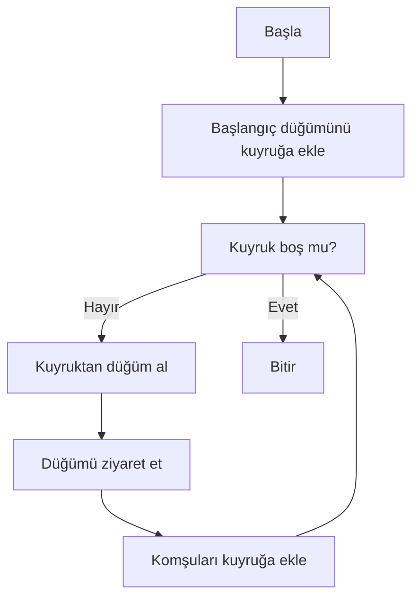
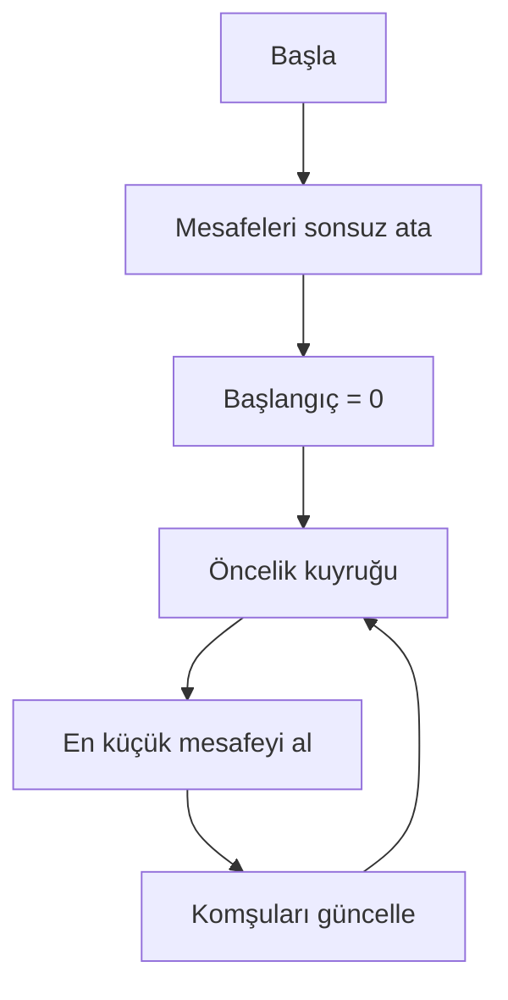
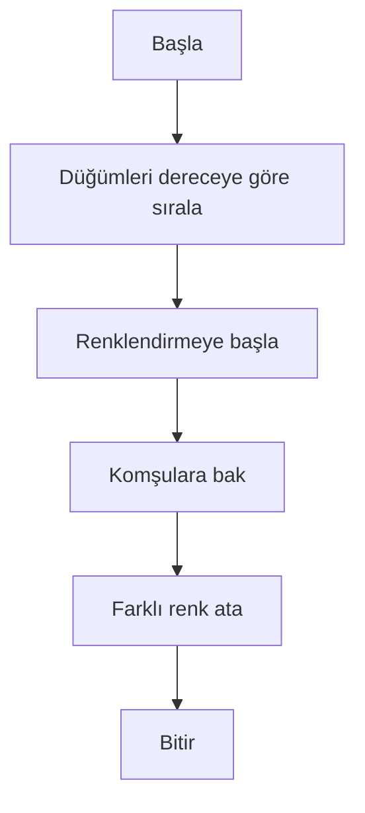
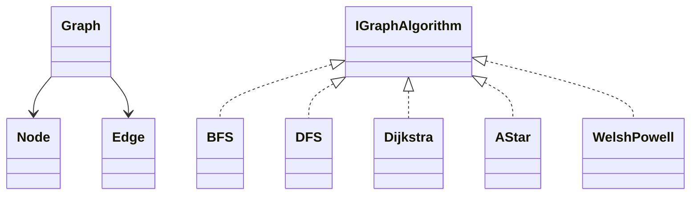

 📊 Sosyal Ağ Analizi Uygulaması
## Social Network Analysis (SNA) – Graph Algorithms

**Ders:** Yazılım Geliştirme Laboratuvarı-I  
**Üniversite:** Kocaeli Üniversitesi – Teknoloji Fakültesi  
**Bölüm:** Bilişim Sistemleri Mühendisliği  
**Proje:** Proje–2  
**Grup:** 46

**Ekip Üyeleri:**  
- Cihat KARATAŞ 231307078
- İbrahim KIZILARSLAN 231307045

**Ekip Üyeleri:**  
- Öğr. Gör. Yavuz Selim FATİHOĞLU

**Tarih:** 2 Ocak 2026

---

## 1️⃣ Giriş – Problem Tanımı ve Amaç

Günümüzde sosyal ağlar; bireyler, kurumlar ve sistemler arasındaki ilişkilerin modellenmesi ve analiz edilmesi açısından büyük önem taşımaktadır. Bu projede, kullanıcılar ve aralarındaki bağlantılar bir graf veri yapısı ile modellenmiş ve çeşitli graf algoritmaları uygulanarak ağ üzerindeki ilişkiler analiz edilmiştir.

**Projenin temel amacı:**
- Graf veri yapılarının pratik kullanımını öğrenmek
- BFS, DFS, Dijkstra, A*, Welsh–Powell gibi algoritmaları uygulamak
- Nesne yönelimli tasarım prensiplerini kullanmak
- Sonuçları görsel ve etkileşimli biçimde sunmak

Bu kapsamda geliştirilen uygulama, sosyal ağ analizine yönelik kapsamlı bir simülasyon ortamı sunmaktadır.

---

## 2️⃣ Gerçeklenen Algoritmalar

Bu projede aşağıdaki algoritmalar ayrı ayrı tetiklenebilir şekilde gerçeklenmiştir.

### 🔹 Breadth-First Search (BFS)

**Amaç:**  
Belirli bir düğümden erişilebilen tüm kullanıcıları seviye seviye keşfetmek.

**Çalışma Mantığı:**
- Kuyruk (queue) veri yapısı kullanılır
- Önce en yakın komşular ziyaret edilir

**Zaman Karmaşıklığı:**  
O(V + E)

**Literatür:** BFS algoritması, özellikle en kısa yolun kenar sayısına göre arandığı problemsel yapılarda yaygın olarak kullanılmaktadı



### 🔹 Depth-First Search (DFS)

**Amaç:**  
Grafın derinlemesine taranması.

**Zaman Karmaşıklığı:**  
O(V + E)

**Literatür:** DFS, bağlı bileşenler ve çevrim tespiti gibi problemlerde etkin olarak kullanılır.

**Kullanım Alanı:**
- Bağlantılılık analizi
- Topluluk keşfi

### 🔹 Dijkstra En Kısa Yol Algoritması

**Amaç:**  
İki düğüm arasındaki minimum maliyetli yolu bulmak.

**Zaman Karmaşıklığı:**  
O((V + E) log V)

**Literatür:** Dijkstra algoritması, pozitif ağırlıklı graflarda optimal çözüm sunar.


### 🔹 A* (A-Star) Algoritması

**Amaç:**  
Heuristic fonksiyon kullanarak hedefe daha hızlı ulaşmak.

**Literatür:** A*, Dijkstra’nın heuristic destekli versiyonudur ve yol bulma problemlerinde yaygındır.

**Avantajı:**
- Dijkstra’ya göre daha verimli
- Hedef odaklı arama

### 🔹 Bağlı Bileşenler (Connected Components)

**Amaç:**  
Graf içerisindeki ayrık toplulukları tespit etmek.

**Kullanım:**
- Sosyal grupların belirlenmesi

### 🔹 Degree Centrality (Merkezilik)

**Amaç:**  
En etkili (merkezi) kullanıcıların belirlenmesi.
- Her düğümün derece sayısı hesaplanır
- En yüksek dereceye sahip ilk 5 düğüm tablo halinde gösterilir

### 🔹 Welsh–Powell Graf Renklendirme

**Amaç:**  
Komşu düğümlerin farklı renklerle boyanması.

**Zaman Karmaşıklığı:**  
O(V² + E)



---

## 3️⃣ Sınıf Yapısı ve Mimari Tasarım

Uygulama katmanlı mimari ve nesne yönelimli tasarım prensiplerine uygun olarak geliştirilmiştir.

### 📦 Katmanlar
1. Presentation Layer (WinForms UI)
2. Business Logic Layer
3. Data Access Layer



---

## 4️⃣ Veri Saklama ve Dinamik Ağırlık Hesaplama

### 📂 Veri Formatları
*   **CSV:** Node özellikleri
*   **JSON:** Graf yapısı

### 📌 Komşuluk Listesi (Örnek)
```text
1 -> 2,3,4
2 -> 1,5
```

### 📌 Komşuluk Matrisi (Örnek)
|   | 1 | 2 | 3 |
|---|---|---|---|
| **1** | 0 | 1 | 1 |
| **2** | 1 | 0 | 0 |
| **3** | 1 | 0 | 0 |

### ⚖️ Ağırlık Formülü
İki düğüm arasındaki ağırlık (weight) aşağıdaki formül ile hesaplanmaktadır:

```math
weight(i,j) = \frac{1}{1 + (A_i - A_j)^2 + (E_i - E_j)^2 + (B_i - B_j)^2}
```

---

## 5️⃣ Uygulama Arayüzü, Testler ve Sonuçlar

### 🖥️ Kullanıcı Arayüzü
- WinForms tabanlı
- Graf canvas üzerinde çizilmektedir
- Düğüm tıklama ile detay görüntüleme
- Algoritmalar butonlarla tetiklenmektedir

### 🧪 Algoritma Performansı (Tahmini Süreler)

| Algoritma | 20 Düğüm | 50 Düğüm |
|-----------|----------|----------|
| **BFS** | 5 ms | 18 ms |
| **DFS** | 4 ms | 15 ms |
| **Dijkstra** | 7 ms | 32 ms |
| **A*** | 6 ms | 25 ms |
| **Welsh–Powell** | 9 ms | 40 ms |

Tüm algoritmalar kabul edilebilir sürelerde çalışmıştır.

---

## 6️⃣ Sonuç, Başarılar ve Geliştirme Önerileri

### ⚠️ Hata Yönetimi
- Aynı düğüm eklenmesi engellenmiştir.
- Self-loop bağlantılar reddedilmektedir.
- Geçersiz veri girişleri kontrol edilmektedir.


### ✅ Başarılar
- Tüm istenen algoritmalar başarıyla gerçeklenmiştir
- OOP ve SOLID prensiplerine uyulmuştur
- Görsel ve etkileşimli bir sistem geliştirilmiştir

### ⚠️ Sınırlılıklar
- Çok büyük graflar için performans sınırlıdır
- WinForms platform bağımlıdır

### 🚀 Olası Geliştirmeler
- Web tabanlı arayüz (Blazor / React)
- Daha büyük veri setleri
- Gerçek sosyal ağ verileri ile analiz

### 📌 Genel Değerlendirme
Bu proje ile graf algoritmaları, sosyal ağ analizi ve yazılım mimarisi konularında kapsamlı bir uygulama geliştirilmiş, teorik bilgiler pratikte başarıyla uygulanmıştır.


