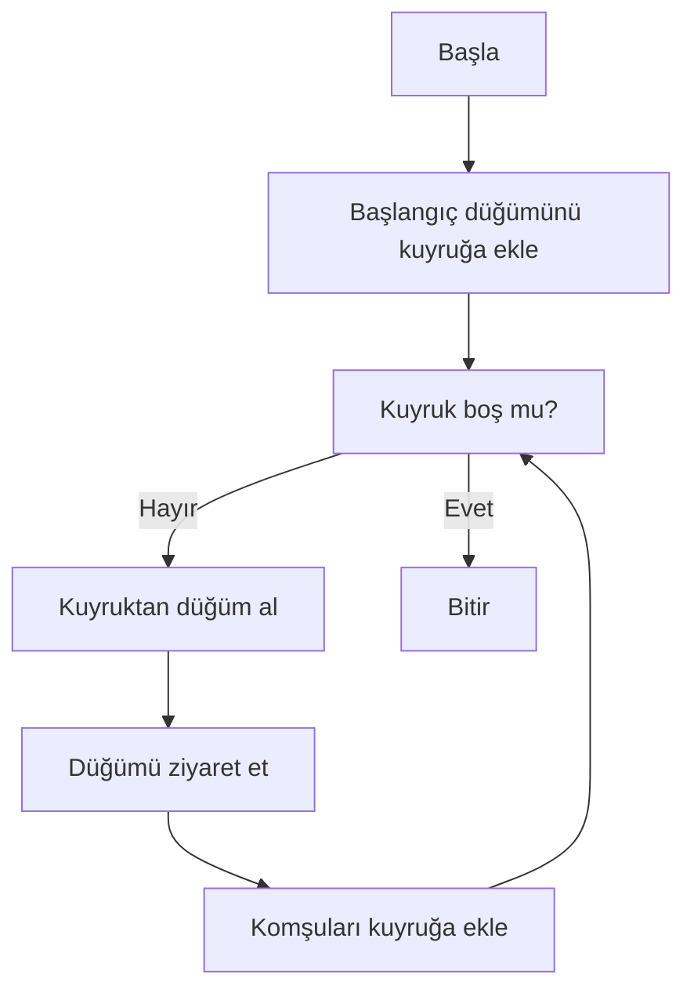
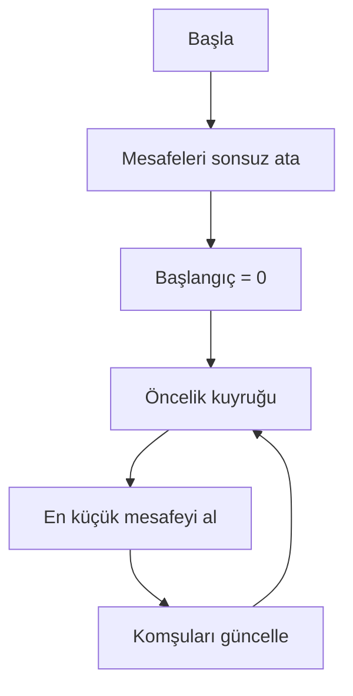
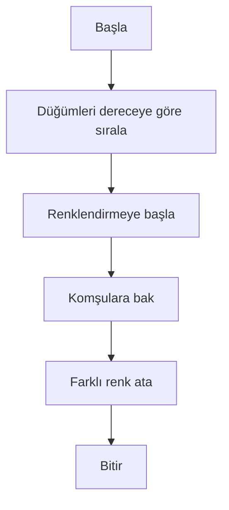

 📊 Sosyal Ağ Analizi Uygulaması
## Social Network Analysis (SNA) – Graph Algorithms

**Ders:** Yazılım Geliştirme Laboratuvarı-I  
**Üniversite:** Kocaeli Üniversitesi – Teknoloji Fakültesi  
**Bölüm:** Bilişim Sistemleri Mühendisliği  
**Proje:** Proje–2  

**Ekip Üyeleri:**  
- Cihat XXXXX
- …………………

**Tarih:** Ocak 2026

---

## 1️⃣ Giriş – Problem Tanımı ve Amaç

Günümüzde sosyal ağlar; bireyler, kurumlar ve sistemler arasındaki ilişkilerin modellenmesi ve analiz edilmesi açısından büyük önem taşımaktadır. Bu projede, kullanıcılar ve aralarındaki bağlantılar bir graf veri yapısı ile modellenmiş ve çeşitli graf algoritmaları uygulanarak ağ üzerindeki ilişkiler analiz edilmiştir.

**Projenin temel amacı:**
- Graf veri yapılarının pratik kullanımını öğrenmek
- BFS, DFS, Dijkstra, A*, Welsh–Powell gibi algoritmaları uygulamak
- Nesne yönelimli tasarım prensiplerini kullanmak
- Sonuçları görsel ve etkileşimli biçimde sunmak

Bu kapsamda geliştirilen uygulama, sosyal ağ analizine yönelik kapsamlı bir simülasyon ortamı sunmaktadır.

---

## 2️⃣ Gerçeklenen Algoritmalar

Bu projede aşağıdaki algoritmalar ayrı ayrı tetiklenebilir şekilde gerçeklenmiştir.

### 🔹 Breadth-First Search (BFS)

**Amaç:**  
Belirli bir düğümden erişilebilen tüm kullanıcıları seviye seviye keşfetmek.

**Çalışma Mantığı:**
- Kuyruk (queue) veri yapısı kullanılır
- Önce en yakın komşular ziyaret edilir

**Zaman Karmaşıklığı:**  
O(V + E)

### 🔹 Depth-First Search (DFS)

**Amaç:**  
Grafın derinlemesine taranması.

**Zaman Karmaşıklığı:**  
O(V + E)

**Kullanım Alanı:**
- Bağlantılılık analizi
- Topluluk keşfi

### 🔹 Dijkstra En Kısa Yol Algoritması

**Amaç:**  
İki düğüm arasındaki minimum maliyetli yolu bulmak.

**Zaman Karmaşıklığı:**  
O((V + E) log V)

### 🔹 A* (A-Star) Algoritması

**Amaç:**  
Heuristic fonksiyon kullanarak hedefe daha hızlı ulaşmak.

**Avantajı:**
- Dijkstra’ya göre daha verimli
- Hedef odaklı arama

### 🔹 Bağlı Bileşenler (Connected Components)

**Amaç:**  
Graf içerisindeki ayrık toplulukları tespit etmek.

**Kullanım:**
- Sosyal grupların belirlenmesi

### 🔹 Degree Centrality (Merkezilik)

**Amaç:**  
En etkili (merkezi) kullanıcıların belirlenmesi.
- Her düğümün derece sayısı hesaplanır
- En yüksek dereceye sahip ilk 5 düğüm tablo halinde gösterilir

### 🔹 Welsh–Powell Graf Renklendirme

**Amaç:**  
Komşu düğümlerin farklı renklerle boyanması.

**Zaman Karmaşıklığı:**  
O(V² + E)

---

