 📊 Sosyal Ağ Analizi Uygulaması
## Social Network Analysis (SNA) – Graph Algorithms

**Ders:** Yazılım Geliştirme Laboratuvarı-I  
**Üniversite:** Kocaeli Üniversitesi – Teknoloji Fakültesi  
**Bölüm:** Bilişim Sistemleri Mühendisliği  
**Proje:** Proje–2  
**Grup:** 46

**Ekip Üyeleri:**  
- Cihat KARATAŞ 231307078
- İbrahim KIZILARSLAN 231307045

**Ekip Üyeleri:**  
- Öğr. Gör. Yavuz Selim FATİHOĞLU

**Tarih:** 2 Ocak 2026

---

## 1️⃣ Giriş – Problem Tanımı ve Amaç

Günümüzde sosyal ağlar; bireyler, kurumlar ve sistemler arasındaki ilişkilerin modellenmesi ve analiz edilmesi açısından büyük önem taşımaktadır. Bu projede, kullanıcılar ve aralarındaki bağlantılar bir graf veri yapısı ile modellenmiş ve çeşitli graf algoritmaları uygulanarak ağ üzerindeki ilişkiler analiz edilmiştir.

**Projenin temel amacı:**
- Graf veri yapılarının pratik kullanımını öğrenmek
- BFS, DFS, Dijkstra, A*, Welsh–Powell gibi algoritmaları uygulamak
- Nesne yönelimli tasarım prensiplerini kullanmak
- Sonuçları görsel ve etkileşimli biçimde sunmak

Bu kapsamda geliştirilen uygulama, sosyal ağ analizine yönelik kapsamlı bir simülasyon ortamı sunmaktadır.

---

## 2️⃣ Gerçeklenen Algoritmalar

Bu projede aşağıdaki algoritmalar ayrı ayrı tetiklenebilir şekilde gerçeklenmiştir.

### 🔹 Breadth-First Search (BFS)

**Amaç:**  
Belirli bir düğümden erişilebilen tüm kullanıcıları seviye seviye keşfetmek.

**Çalışma Mantığı:**
- Kuyruk (queue) veri yapısı kullanılır
- Önce en yakın komşular ziyaret edilir

**Zaman Karmaşıklığı:**  
O(V + E)

```mermaid
flowchart TD
    A[Başla] --> B[Başlangıç düğümünü kuyruğa ekle]
    B --> C[Kuyruk boş mu?]
    C -- Hayır --> D[Kuyruktan düğüm al]
    D --> E[Düğümü ziyaret et]
    E --> F[Komşuları kuyruğa ekle]
    F --> C
    C -- Evet --> G[Bitir]
```

### 🔹 Depth-First Search (DFS)

**Amaç:**  
Grafın derinlemesine taranması.

**Zaman Karmaşıklığı:**  
O(V + E)

**Kullanım Alanı:**
- Bağlantılılık analizi
- Topluluk keşfi

### 🔹 Dijkstra En Kısa Yol Algoritması

**Amaç:**  
İki düğüm arasındaki minimum maliyetli yolu bulmak.

**Zaman Karmaşıklığı:**  
O((V + E) log V)

```mermaid
flowchart TD
    A[Başla] --> B[Mesafeleri sonsuz ata]
    B --> C[Başlangıç = 0]
    C --> D[Öncelik kuyruğu]
    D --> E[En küçük mesafeyi al]
    E --> F[Komşuları güncelle]
    F --> D
```

### 🔹 A* (A-Star) Algoritması

**Amaç:**  
Heuristic fonksiyon kullanarak hedefe daha hızlı ulaşmak.

**Avantajı:**
- Dijkstra’ya göre daha verimli
- Hedef odaklı arama

### 🔹 Bağlı Bileşenler (Connected Components)

**Amaç:**  
Graf içerisindeki ayrık toplulukları tespit etmek.

**Kullanım:**
- Sosyal grupların belirlenmesi

### 🔹 Degree Centrality (Merkezilik)

**Amaç:**  
En etkili (merkezi) kullanıcıların belirlenmesi.
- Her düğümün derece sayısı hesaplanır
- En yüksek dereceye sahip ilk 5 düğüm tablo halinde gösterilir

### 🔹 Welsh–Powell Graf Renklendirme

**Amaç:**  
Komşu düğümlerin farklı renklerle boyanması.

**Zaman Karmaşıklığı:**  
O(V² + E)

```mermaid
flowchart TD
    A[Başla] --> B[Düğümleri dereceye göre sırala]
    B --> C[Renklendirmeye başla]
    C --> D[Komşulara bak]
    D --> E[Farklı renk ata]
    E --> F[Bitir]
```

---

## 3️⃣ Sınıf Yapısı ve Mimari Tasarım

Uygulama katmanlı mimari ve nesne yönelimli tasarım prensiplerine uygun olarak geliştirilmiştir.

### 📦 Katmanlar
1. Presentation Layer (WinForms UI)
2. Business Logic Layer
3. Data Access Layer

---

## 4️⃣ Dinamik Ağırlık Hesaplama

Her düğüm aşağıdaki sayısal özelliklere sahiptir:
- Aktivite
- Etkileşim
- Bağlantı Sayısı

**Ağırlık Formülü:**

$$ weight(i,j) = \frac{1}{1 + (A_i - A_j)^2 + (E_i - E_j)^2 + (B_i - B_j)^2} $$

- Benzer düğümler → **yüksek ağırlık**
- Farklı düğümler → **düşük ağırlık**

Bu ağırlıklar tüm algoritmalarda kenar maliyeti olarak kullanılmıştır.

---

## 5️⃣ Uygulama Arayüzü, Testler ve Sonuçlar

### 🖥️ Kullanıcı Arayüzü
- WinForms tabanlı
- Graf canvas üzerinde çizilmektedir
- Düğüm tıklama ile detay görüntüleme
- Algoritmalar butonlarla tetiklenmektedir

*(Ekran görüntüleri buraya eklenecektir)*

### 🧪 Test Senaryoları

| Test Grafı | Düğüm Sayısı | Sonuç |
| :--- | :--- | :--- |
| Küçük | 10–20 | Başarılı |
| Orta | 50–100 | Başarılı |

Tüm algoritmalar kabul edilebilir sürelerde çalışmıştır.

---

## 6️⃣ Sonuç, Başarılar ve Geliştirme Önerileri

### ✅ Başarılar
- Tüm istenen algoritmalar başarıyla gerçeklenmiştir
- OOP ve SOLID prensiplerine uyulmuştur
- Görsel ve etkileşimli bir sistem geliştirilmiştir

### ⚠️ Sınırlılıklar
- Çok büyük graflar için performans sınırlıdır
- WinForms platform bağımlıdır

### 🚀 Olası Geliştirmeler
- Web tabanlı arayüz (Blazor / React)
- Daha büyük veri setleri
- Gerçek sosyal ağ verileri ile analiz

### 📌 Genel Değerlendirme
Bu proje ile graf algoritmaları, sosyal ağ analizi ve yazılım mimarisi konularında kapsamlı bir uygulama geliştirilmiş, teorik bilgiler pratikte başarıyla uygulanmıştır.

