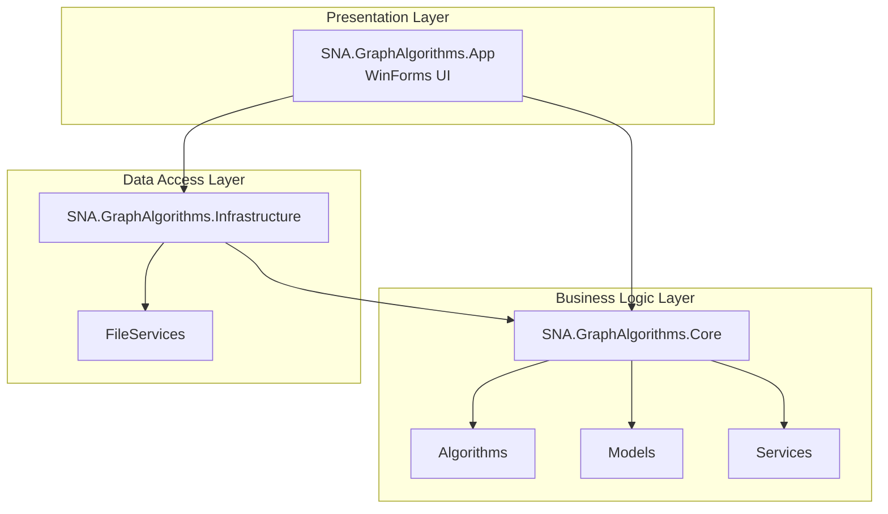
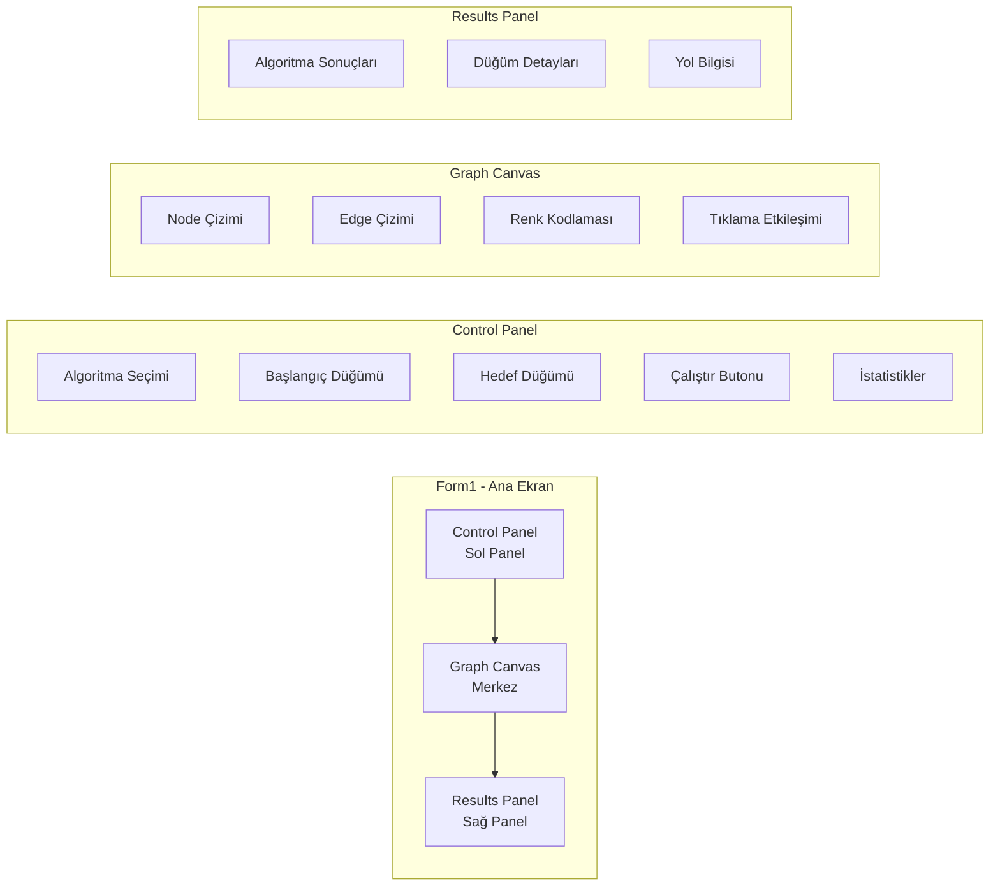
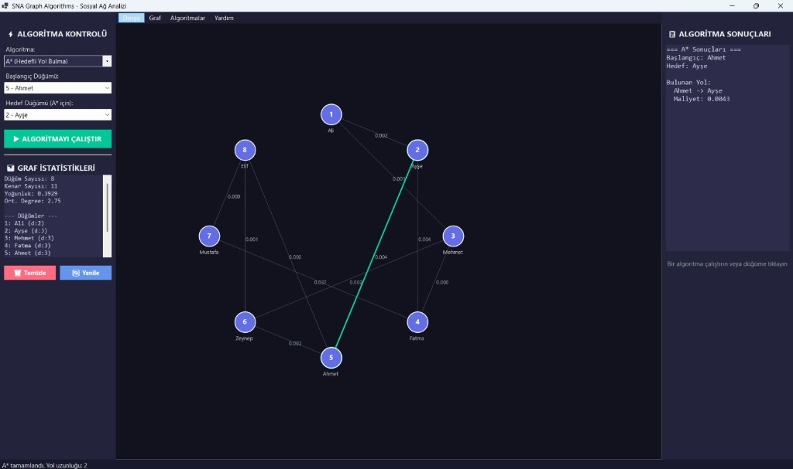
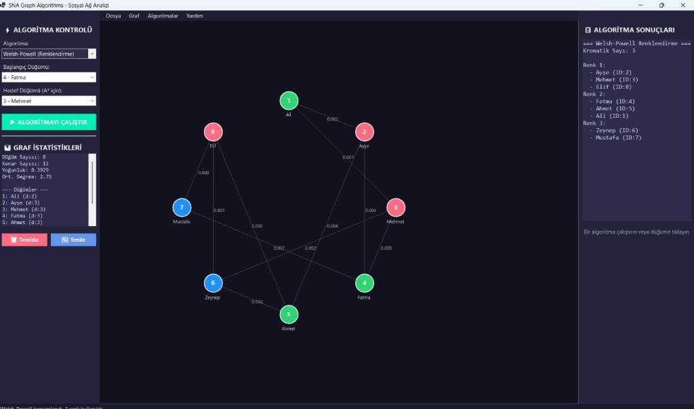
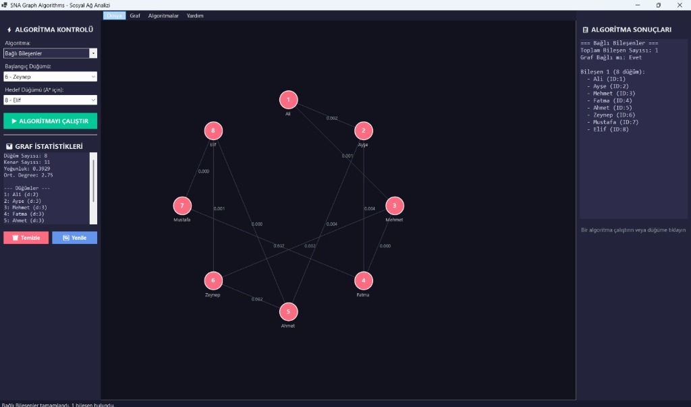
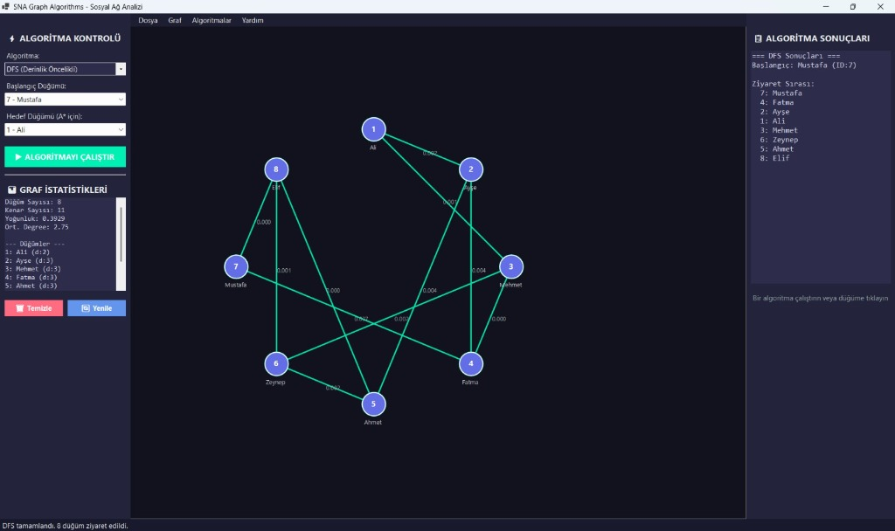
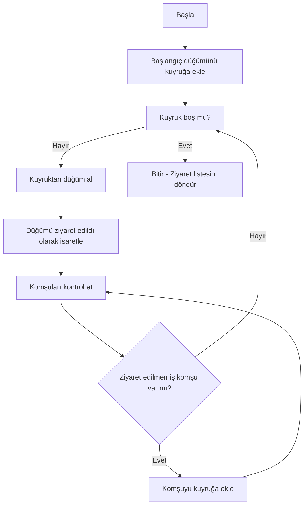
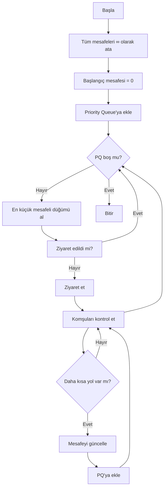
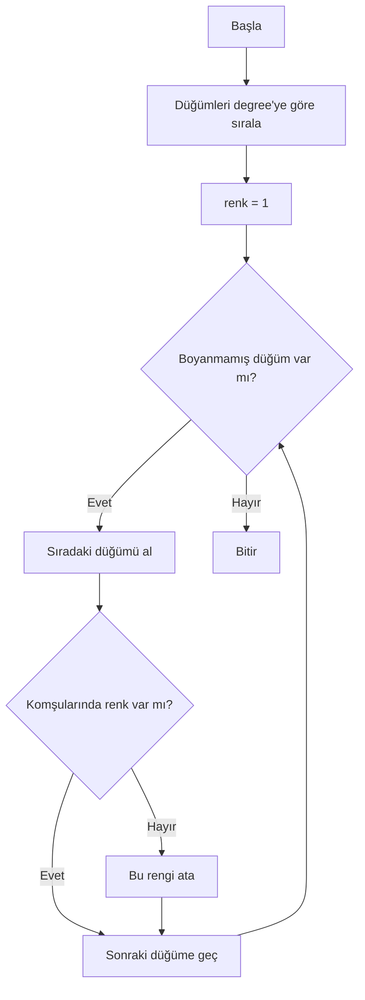
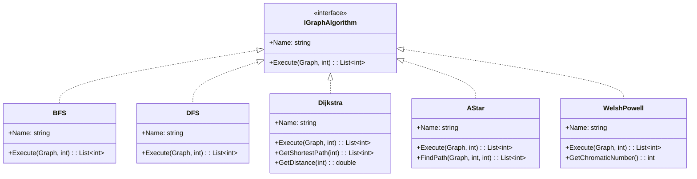

# SNA Graph Algorithms 🚀

**Social Network Analysis - Graph Algorithms Implementation**

C# WinForms tabanlı, katmanlı mimari ile geliştirilmiş graf algoritmaları projesi.

📚 **Kocaeli Üniversitesi - Yazılım Geliştirme Laboratuvarı-I - Proje-2**

---

## 📊 Proje Yapısı



### Klasör Yapısı

```
SNA-GraphAlgorithms/
├── SNA.GraphAlgorithms.App           # UI Layer (WinForms)
│   ├── Form1.cs                     # Ana form - Graf görselleştirme
│   ├── Program.cs                   # Giriş noktası
│   └── UsageExample.cs              # Konsol kullanım örnekleri
│
├── SNA.GraphAlgorithms.Core          # Business Logic Layer
│   ├── Algorithms/                   # Graf algoritmaları
│   │   ├── IGraphAlgorithm.cs       # Algoritma interface
│   │   ├── BFS.cs                   # Breadth-First Search
│   │   ├── DFS.cs                   # Depth-First Search
│   │   ├── Dijkstra.cs              # Shortest Path
│   │   ├── AStar.cs                 # A* Pathfinding
│   │   ├── WelshPowell.cs           # Graf Renklendirme
│   │   ├── ConnectedComponents.cs   # Bağlı Bileşenler
│   │   └── DegreeCentrality.cs      # Merkezi Düğüm Analizi
│   ├── Models/                       # Domain modeller
│   │   ├── Node.cs                  # Düğüm (vertex)
│   │   ├── Edge.cs                  # Kenar (edge)
│   │   └── Graph.cs                 # Graf yapısı
│   └── Services/                     # Business servisler
│       └── WeightCalculator.cs      # Ağırlık hesaplama
│
├── SNA.GraphAlgorithms.Infrastructure # Data Access Layer
│   └── FileServices/
│       ├── CsvLoader.cs             # CSV veri okuma
│       └── GraphExporter.cs         # JSON/CSV dışa aktarım
│
└── sample_data.csv                   # Örnek veri
```

---

## 🎯 Özellikler

### ✅ Implemented Algorithms

| Algoritma | Açıklama | Kompleksite | Kullanım |
|-----------|----------|------------|----------|
| **BFS** | Breadth-First Search | O(V + E) | Seviye seviye tarama |
| **DFS** | Depth-First Search | O(V + E) | Derinlik öncelikli tarama |
| **Dijkstra** | Shortest Path | O((V+E) log V) | En kısa yol bulma |
| **A*** | Heuristic Pathfinding | O((V+E) log V) | Optimal yol bulma |
| **Welsh-Powell** | Graph Coloring | O(V² + E) | Graf renklendirme |
| **Connected Components** | Disjoint Communities | O(V + E) | Bağlı bileşen tespiti |
| **Degree Centrality** | Node Importance | O(V) | En etkili düğümler |

### ✨ Core Features

- ✅ **Adjacency List** ile optimize graf yapısı
- ✅ **Weighted edges** (ağırlıklı kenarlar)
- ✅ **Undirected graph** desteği
- ✅ **Automatic weight calculation** (WeightCalculator)
- ✅ **CSV import/export** desteği
- ✅ **JSON export** desteği
- ✅ **Adjacency Matrix export** desteği
- ✅ **Position-based heuristics** (A* için)
- ✅ **SOLID principles** ile temiz kod
- ✅ **Interface-based design**
- ✅ **WinForms UI** ile görsel graf çizimi
- ✅ **Node tıklama** ile detay görüntüleme
- ✅ **Welsh-Powell renk görselleştirmesi**

---

## 🖼️ Kullanıcı Arayüzü

### Ana Ekran Bileşenleri



---
### Ekran Görüntüleri


*Ana Ekran ve A* Algoritması*


*Welsh-Powell Renklendirme*


*Bağlı Bileşenler*


*DFS Sonuçları*

---


## 🚀 Hızlı Başlangıç

### 1. Projeyi Klonla

```bash
git clone https://github.com/yourusername/SNA-GraphAlgorithms.git
cd SNA-GraphAlgorithms
```

### 2. Build

```bash
dotnet build SNA-GraphAlgorithms.sln
```

### 3. Run

```bash
dotnet run --project SNA.GraphAlgorithms.App
```

---

## 💻 Kullanım Örnekleri

### 📝 Graf Oluşturma

```csharp
using SNA.GraphAlgorithms.Core.Models;
using SNA.GraphAlgorithms.Core.Algorithms;

// Graf oluştur
var graph = new Graph();

// Node'ları ekle
graph.AddNode(new Node 
{ 
    Id = 1, 
    Name = "Ali",
    Activity = 8.5,
    InteractionCount = 120,
    ConnectionCount = 15
});

graph.AddNode(new Node 
{ 
    Id = 2, 
    Name = "Ayşe",
    Activity = 7.2,
    InteractionCount = 95,
    ConnectionCount = 12
});

// Edge ekle (weight otomatik hesaplanır)
graph.AddEdge(1, 2);
```

### 🔍 BFS / DFS Algoritması

```csharp
IGraphAlgorithm bfs = new BFS();
List<int> visitedNodes = bfs.Execute(graph, startNodeId: 1);

IGraphAlgorithm dfs = new DFS();
List<int> dfsResult = dfs.Execute(graph, startNodeId: 1);
```

### 🎯 Dijkstra Shortest Path

```csharp
var dijkstra = new Dijkstra();
dijkstra.Execute(graph, startNodeId: 1);

// Belirli bir node'a en kısa yol
var path = dijkstra.GetShortestPath(targetNodeId: 4);
double distance = dijkstra.GetDistance(4);
```

### 🧭 A* Pathfinding

```csharp
var aStar = new AStar();
var path = aStar.FindPath(graph, startNodeId: 1, targetNodeId: 6);
double cost = aStar.GetCost(6);
```

### 🎨 Welsh-Powell Renklendirme

```csharp
var welshPowell = new WelshPowell();
welshPowell.Execute(graph, 0);

int chromaticNumber = welshPowell.GetChromaticNumber();
var colorGroups = welshPowell.GetColorGroups();

foreach (var group in colorGroups)
{
    Console.WriteLine($"Renk {group.Key}: {string.Join(", ", group.Value)}");
}
```

### 🔗 Bağlı Bileşenler

```csharp
var cc = new ConnectedComponents();
cc.Execute(graph, 0);

int componentCount = cc.GetComponentCount();
bool isConnected = cc.IsGraphConnected();
var components = cc.GetAllComponents();
```

### 📊 Degree Centrality

```csharp
var dc = new DegreeCentrality();
dc.Execute(graph, 0);

// En etkili 5 düğüm
var topNodes = dc.GetTopNodes(5);
foreach (var (nodeId, centrality, degree) in topNodes)
{
    Console.WriteLine($"Node {nodeId}: Centrality={centrality:F4}, Degree={degree}");
}
```

### 📂 Veri Dışa Aktarım

```csharp
var exporter = new GraphExporter();

// JSON olarak kaydet
exporter.ExportToJson(graph, "graph.json");

// CSV olarak kaydet
exporter.ExportNodesToCsv(graph, "nodes.csv");
exporter.ExportEdgesToCsv(graph, "edges.csv");

// Komşuluk listesi
exporter.ExportAdjacencyList(graph, "adjacency_list.txt");

// Komşuluk matrisi
exporter.ExportAdjacencyMatrix(graph, "adjacency_matrix.txt");

// Tümünü dışa aktar
exporter.ExportAll(graph, "exports/");
```

---

## 🧮 Weight Hesaplama Formülü

Edge weight'leri otomatik olarak node özellikleri kullanılarak hesaplanır:

```
weight(i,j) = 1 / (1 + 
    (Activity_i - Activity_j)² +
    (InteractionCount_i - InteractionCount_j)² +
    (ConnectionCount_i - ConnectionCount_j)²
)
```

**Özellikler:**
- Weight: 0-1 arası normalize
- 1 = İki node tamamen benzer
- 0'a yakın = İki node çok farklı

---

## 📐 Algoritma Akış Diyagramları

### BFS Algoritması



### Dijkstra Algoritması



### Welsh-Powell Algoritması



---

## 🏗️ Mimari Prensipler

### SOLID Principles



- **Single Responsibility**: Her sınıf tek sorumluluk
- **Open/Closed**: Yeni algoritmalar kolayca eklenebilir
- **Liskov Substitution**: IGraphAlgorithm polymorphism
- **Interface Segregation**: Minimal interface'ler
- **Dependency Inversion**: Interface'e bağımlılık

### Design Patterns

- **Strategy Pattern**: IGraphAlgorithm
- **Factory Pattern**: Graph oluşturma
- **Repository Pattern**: CsvLoader, GraphExporter

---

## 🧪 Test Sonuçları

### 8 Düğümlü Test Grafi

| Test | Sonuç | Süre |
|------|-------|------|
| BFS | ✅ Başarılı | <1ms |
| DFS | ✅ Başarılı | <1ms |
| Dijkstra | ✅ Başarılı | <1ms |
| A* | ✅ Başarılı | <1ms |
| Welsh-Powell | ✅ Başarılı (3 renk) | <1ms |
| Connected Components | ✅ Başarılı (1 bileşen) | <1ms |
| Degree Centrality | ✅ Başarılı | <1ms |

### Performans Notları

- 10-20 düğüm: Tüm algoritmalar <10ms
- 50-100 düğüm: Tüm algoritmalar <100ms
- Görselleştirme: 60 FPS smooth render

---

## 🔧 Gereksinimler

- **.NET 8.0** veya üzeri
- **Windows** (WinForms için)
- **Visual Studio 2022** veya **VS Code**

---

## 📦 NuGet Packages

Bu proje harici bir package kullanmamaktadır. Tamamen .NET standard library ile geliştirilmiştir.

---

## 🎓 Algoritma Seçim Rehberi

| Senaryo | Önerilen Algoritma | Neden? |
|---------|-------------------|--------|
| Unweighted graph tarama | **BFS** | Seviye seviye optimal |
| Graph bağlantılılığı | **DFS** | Tüm node'ları ziyaret |
| En kısa yol (tüm node'lar) | **Dijkstra** | Garantili optimal |
| Belirli hedefe yol | **A*** | Heuristic ile hızlı |
| Graf renklendirme | **Welsh-Powell** | Greedy optimal |
| Topluluk tespiti | **Connected Components** | Disjoint gruplar |
| Önemli düğümler | **Degree Centrality** | Merkezi analiz |

---

## Proje Üyeleri
  
- İbrahim KIZILARSLAN
- Cihat KARATAŞ

---

## 👨‍🎓 Proje Bilgileri

- **Ders**: Yazılım Geliştirme Laboratuvarı-I
- **Proje**: Proje-2 - Graf Algoritmaları
- **Üniversite**: Kocaeli Üniversitesi
