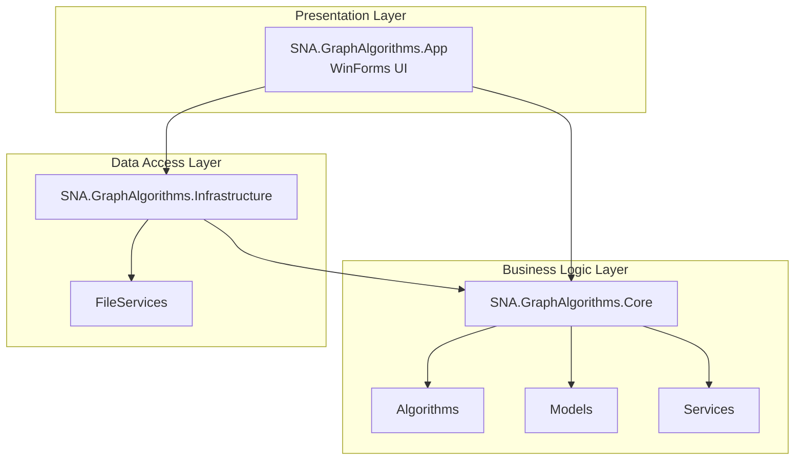

# SNA Graph Algorithms 🚀


**A high-performance implementation of core graph algorithms designed for Social Network Analysis (SNA).**

This project provides a robust framework and GUI application for graph-based data analysis. Developed using **.NET 8.0** and **WinForms**, it features a strictly segmented **n-tier architecture** with a focus on Clean Code and SOLID principles.

---

## 🏗️ Architecture & Design

The project is built on a modular, layered architecture to ensure maintainability and scalability.


```mermaid
graph TB
    subgraph "Presentation Layer"
        UI[SNA.GraphAlgorithms.App<br/>WinForms UI]
    end
    
    subgraph "Business Logic Layer"
        Core[SNA.GraphAlgorithms.Core]
        Algorithms[Algorithms]
        Models[Models]
        Services[Services]
        Core --> Algorithms
        Core --> Models
        Core --> Services
    end
    
    subgraph "Data Access Layer"
        Infra[SNA.GraphAlgorithms.Infrastructure]
        FileServices[FileServices]
        Infra --> FileServices
    end
    
    UI --> Core
    UI --> Infra
    Infra --> Core
```

### Core Components
- **Core Layer:** Contains domain models (Graph, Node, Edge) and algorithm implementations via the Strategy Pattern.
- **Infrastructure Layer:** Handles data persistence, including CSV/JSON import/export and Adjacency Matrix generation.
- **Presentation Layer:** A responsive WinForms application for real-time graph visualization and algorithm execution.

---

## 🎯 Key Features

### 🚀 Implemented Algorithms

| Algorithm | Complexity | Use Case |
|-----------|------------|----------|
| **BFS (Breadth-First Search)** | O(V + E) | Layered traversal / Unweighted shortest path |
| **DFS (Depth-First Search)** | O(V + E) | Connectivity and path discovery |
| **Dijkstra** | O((V+E) log V) | Weighted shortest path optimization |
| **A* (Heuristic Search)** | O((V+E) log V) | Optimal target-driven pathfinding |
| **Welsh-Powell** | O(V² + E) | Optimized graph coloring (Channel allocation, Scheduling) |
| **Connected Components** | O(V + E) | Identifying disjoint sub-networks (Communities) |
| **Degree Centrality** | O(V) | Identifying influential nodes within the network |

### ✨ Technical Highlights
- **Optimized Data Structures:** Adjacency List implementation for memory-efficient graph storage.
- **Dynamic Weight Calculation:** Automated edge weighting based on multi-dimensional node attributes (Activity, Interaction, Connections).
- **Data Portability:** Full support for CSV/JSON serialization and Adjacency Matrix/List exports.
- **Advanced Visualization:** Interactive GUI with real-time graph rendering and interactive node inspection.
- **Clean Code:** Adheres to **SOLID** principles, utilizing **Strategy**, **Factory**, and **Repository** design patterns.

---

## 🖼️ User Interface

The application provides a comprehensive dashboard for managing and analyzing social networks visually.

### Components
- **Control Panel:** Select algorithms, set start/target nodes, and view real-time statistics.
- **Graph Canvas:** Visual representation of nodes and edges with dynamic coloring and layout.
- **Results Panel:** Detailed output of algorithm results, node metrics, and pathing data.

---

## 🚀 Getting Started

### Prerequisites
- [.NET 8.0 SDK](https://dotnet.microsoft.com/download/dotnet/8.0)
- Windows (Required for WinForms)
- Visual Studio 2022 or VS Code

### Installation & Execution

1. **Clone the repository:**
   ```bash
   git clone https://github.com/ibrahimkizilarslan/SNA-GraphAlgorithms.git
   cd SNA-GraphAlgorithms
   ```

2. **Build the solution:**
   ```bash
   dotnet build SNA-GraphAlgorithms.sln
   ```

3. **Run the Application:**
   ```bash
   dotnet run --project SNA.GraphAlgorithms.App
   ```

---

## 💻 Technical Usage Examples

### Graph Construction & Weighting
```csharp
var graph = new Graph();

// Add nodes with SNA-specific attributes
graph.AddNode(new Node 
{ 
    Id = 1, 
    Name = "User A",
    Activity = 8.5,
    InteractionCount = 120,
    ConnectionCount = 15
});

// Edge weights are calculated automatically based on node similarity
graph.AddEdge(1, 2);
```

### Algorithm Execution
```csharp
// Strategy Pattern for algorithm execution
IGraphAlgorithm dijkstra = new Dijkstra();
dijkstra.Execute(graph, startNodeId: 1);

var path = dijkstra.GetShortestPath(targetNodeId: 4);
```

---

## 🧮 Weighted Edge Formula
Edge weights are dynamically calculated to represent similarity/strength between nodes:

$$weight(i,j) = \frac{1}{1 + (A_i - A_j)^2 + (I_i - I_j)^2 + (C_i - C_j)^2}$$

*Where A = Activity, I = Interactions, C = Connections. Results are normalized between 0 and 1.*

---

## 🏗️ Design Principles

- **Single Responsibility (SRP):** Each class handles one specific logic (e.g., FileServices vs. Algorithms).
- **Open/Closed (OCP):** New algorithms can be added by implementing `IGraphAlgorithm` without modifying existing code.
- **Dependency Inversion (DIP):** High-level modules depend on abstractions, not concrete implementations.

---

## 📜 License
Integrated under the MIT License. Feel free to use this project for your own research or development.
